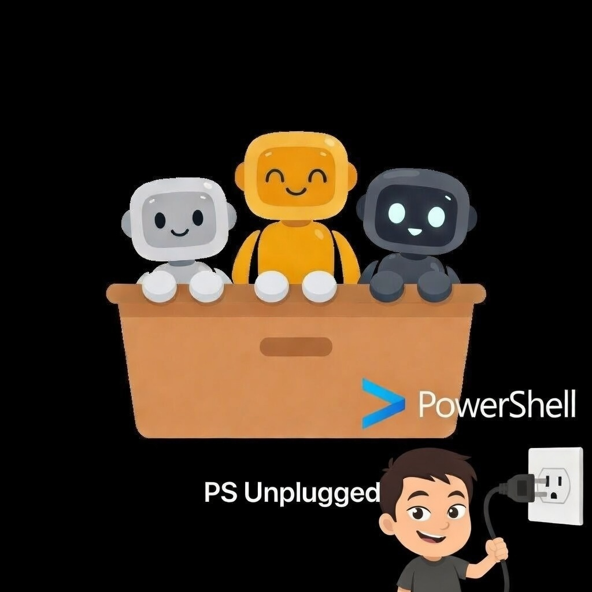

# PSUnplugged
[](https://x.com/dfinke)
[](https://youtube.com/@dougfinke)

<br/>
<div align="center">
  
</div>
<br/>

**PSUnplugged is a PowerShell orchestration shell for OpenAI's Codex App Server. It gives PowerShell users a terminal-native way to drive governed agent work while inheriting native support for conversation history, approvals, streamed agent events, AGENTS.md, MCP servers, skills, and plugins. Instead of rebuilding an agent stack from scratch, PSUnplugged gives agent workflows a legible PowerShell surface for reasoning, execution, and automation.**


<!--

PSUnplugged brings agentic AI directly into your terminal — no IDE, no extensions, no GUI. It's a PowerShell-native client for the OpenAI Codex App Server, giving you multi-turn conversations, streaming responses, and full Markdown rendering right where you already work: the command line.

This is PowerShell as it was always meant to be used — not as a side panel in someone else's editor, but as the runtime itself. PSUnplugged is the bridge between the shell you know and the agentic future that's already here.

 -->

> **This release is read-only.** The agent can read files, answer questions, and reason about your code — but won't write or execute anything. Read/write mode with approval flow is coming in [AI Agent Forge](https://forms.gle/gvw8cU2pgFeXWMNZA).

---

## 🚀 Join the AI Agent Forge Community

**PSUnplugged is the beginning.** The next phase — read/write mode, approval flows, MCP tool integration, and a full agentic workflow engine — is launching through **[AI Agent Forge](https://forms.gle/gvw8cU2pgFeXWMNZA)**.

AI Agent Forge is a community for PowerShell developers stepping into the agentic AI era. Early members get first access to new capabilities as they ship, direct input into the roadmap, and a front-row seat to what's coming next.

👉 **[Join the waitlist](https://forms.gle/gvw8cU2pgFeXWMNZA)**

---

## Why

The IDE with a side-panel chat window is a fossil. The future is agentic workflows running wherever your code runs — including the terminal you already have open.

PowerShell already taught operators how to govern asynchronous work with `Start-Job`, `Get-Job`, and `Receive-Job`. PSUnplugged applies that same instinct to agent workflows: start the work, inspect the work, read the latest useful output, and resume when needed.

PSUnplugged talks directly to the Codex App Server over JSON-RPC via stdio. It gives you a first-class agentic experience from pure PowerShell, on any machine, in any pipeline.

And because the Codex App Server is provider-agnostic, so is PSUnplugged. Point it at OpenAI, Azure, Ollama, Mistral — swap a line in config.toml and you're done.

---

## What's Inside

```
PSUnplugged.psm1          # module — session, threads, turns, JSON-RPC
PSUnplugged.psd1          # module manifest (PowerShell Gallery ready)
ShowMarkdown.psm1         # terminal Markdown renderer
Threads/
  README.md               # project-aware thread/project UX and usage
  PSUnplugged.Threads.psm1 # higher-level project/thread catalog commands
Examples/
  Start-AgentChat.ps1    # interactive REPL — multi-turn chat, streaming, slash commands
  QuickStart.ps1         # working examples for every feature
  Start-StageReadyDemos.ps1 # launcher for stage-ready task, transcript, and artifact demos
```

| File | What it does |
|---|---|
| `PSUnplugged.psm1` | Full PowerShell module — session management, threads, turns, low-level JSON-RPC |
| `PSUnplugged.psd1` | Module manifest — version, author, tags, Gallery metadata |
| `Threads/PSUnplugged.Threads.psm1` | Higher-level thread and project catalog commands |
| `Threads/README.md` | Usage guide for project-aware thread management |
| `Examples/Start-AgentChat.ps1` | Interactive REPL — multi-turn chat, streaming, slash commands |
| `Examples/QuickStart.ps1` | Working examples for every feature |
| `Examples/Start-StageReadyDemos.ps1` | Launcher for stage-ready task, transcript, fan-out, and artifact demos |
| `ShowMarkdown.psm1` | Terminal Markdown renderer — headers, code blocks, tables with box-drawing chars |

---

## Quick Start

**Prerequisites**

1. **Node.js 18+** — [nodejs.org](https://nodejs.org) (provides `npm`)
2. **PowerShell 7+** — [aka.ms/powershell](https://aka.ms/powershell) (Windows ships with 5.1; this module requires 7)
3. **Codex CLI**
   ```powershell
   npm i -g @openai/codex
   ```
4. **Authenticate** — choose one:
   - **ChatGPT account** with access to the Codex runtime model used by this module:
     ```powershell
     codex login
     ```
   - **OpenAI API key** — pass it directly at runtime, no login needed:
     ```powershell
     .\Examples\Start-AgentChat.ps1 -ApiKey $env:OPENAI_API_KEY
     ```
5. **Clone this repo**
   ```powershell
   git clone https://github.com/dfinke/PSUnplugged
   cd PSUnplugged
   ```

> **Windows tip:** If `Start-CodexSession` can't find the binary, set `$env:CODEX_EXE` to the full path of `codex.exe`:
> ```powershell
> $env:CODEX_EXE = (Get-ChildItem (npm root -g) -Recurse -Filter codex.exe | Where-Object { $_.Length -gt 1MB } | Select-Object -First 1).FullName
> ```

**Interactive chat**

```powershell
# ChatGPT account (default model)
.\Examples\Start-AgentChat.ps1

# OpenAI API key
.\Examples\Start-AgentChat.ps1 -Model gpt-5.2 -ApiKey $env:OPENAI_API_KEY
```

**One-liner from a script**

```powershell
Import-Module .\PSUnplugged.psm1

$session = Start-CodexSession
$answer  = Invoke-CodexQuestion -Session $session -Text "What does this repo do?"
Write-Host $answer
Stop-CodexSession -Session $session
```

**Multi-turn conversation**

```powershell
$session = Start-CodexSession
$thread  = New-CodexThread -Session $session -Cwd (Get-Location).Path

$r1 = Invoke-CodexTurn -Session $session -ThreadId $thread.id -Text "List the files here"
$r2 = Invoke-CodexTurn -Session $session -ThreadId $thread.id -Text "Now explain what each one does"

Stop-CodexSession -Session $session
```

**Task-first workflow**

```powershell
$pending = Start-CodexTask -Cwd (Get-Location).Path -Name repo-tour -Prompt "List the files here and explain what each one does"
$pending | Get-CodexTask
$task = $pending | Wait-CodexTask

Get-CodexTask -ActiveOnly
Receive-CodexTask -Id $task.TaskId
Receive-CodexTask -Id $task.TaskId -Text
Resume-CodexTask -Id $task.TaskId -Prompt "Now turn that into a checklist"
```

**Pipeline-style task workflow**

```powershell
Start-CodexTask -Cwd . -Prompt "Summarize this repo" |
  Wait-CodexTask |
  Receive-CodexTask -Text
```

You can also pipe multiple prompt strings into `Start-CodexTask` while supplying a shared working directory:

```powershell
$tasks = @(
  "Review error handling"
  "Add README examples"
  "Write Pester tests"
) | Start-CodexTask -Cwd .

$tasks | Get-CodexTask
$tasks | Receive-CodexTask -Transcript -ShowTelemetry
```

**Live tail for long-running work**

```powershell
Start-CodexTask -Cwd .\scratch\new-work -CreateCwd -Prompt "Read the last 2 issues and summarize" |
  Wait-CodexTask -Tail -TimeoutSec 900 |
  Receive-CodexTask -Text
```

**Live operator telemetry**

```powershell
Start-CodexTask -Cwd .\scratch\new-work -CreateCwd -Prompt "Inspect this workspace and explain what you're doing" |
  Wait-CodexTask -Tail -ShowAll -TimeoutSec 900 |
  Receive-CodexTask -Text
```

```powershell
Receive-CodexTask -Id $task.TaskId -Details
```

**Stage-ready demos**

```powershell
# See the demo menu and copy-ready commands
.\Examples\Start-StageReadyDemos.ps1

# Turn the repo into an executive-ready technical brief
.\Examples\Start-BoardroomBriefDemo.ps1 -Cwd .

# Launch parallel specialist agents and collect the results
.\Examples\Start-AgentSwarmDemo.ps1 -Cwd .

# Prove agent work is recoverable through threads and transcripts
.\Examples\Show-AgentFlightRecorderDemo.ps1 -Project .

# Create a scratch workspace and produce demo artifacts
.\Examples\Start-ArtifactSprintDemo.ps1
```

**Create a working folder on demand**

```powershell
Start-CodexTask -Cwd .\scratch\repo-notes -CreateCwd -Prompt "Create a working plan for this new folder"
```

**Slash commands inside the chat REPL**

```
/new         start a fresh thread
/model <n>   switch model and start a new thread
/verbose     toggle raw JSON-RPC output
/quit        exit
```

**Thread settings used by `Start-AgentChat.ps1`**

The interactive example starts each thread with these Codex App Server settings:

- `approvalPolicy = "never"`
  - Do not pause for approval prompts.
  - Other supported values in this module are `on-request` and `unless-trusted`.
- `sandbox = "workspace-write"`
  - Use the workspace-write sandbox mode for the thread.
  - Other supported values in this module are `read-only` and `danger-full-access`.

These values are also exposed by `New-CodexThread` in `PSUnplugged.psm1` as:

- `-ApprovalPolicy`
- `-SandboxType`

## PowerShell Mental Model

PSUnplugged works best when you think about agent work the way PowerShell already treats jobs.

- `Start-CodexSession` is the connected runtime context for the current shell.
- `Start-CodexTask` is the task-first operator surface when you want job-style language.
- `Start-CodexTask` defaults to `gpt-5.2`, matching the minimum supported Codex runtime model.
- `New-CodexThread` starts a unit of agent work in that runtime.
- `Get-CodexTask` is the task-first inspection view and defaults to the current working directory (`-Project '*'` lists everything).
- `Get-CodexTask -ActiveOnly` narrows that view to tasks that are still in play.
- `Get-CodexTask` also shows `starting` tasks while their worker process is booting.
- `Get-CodexTask` surfaces task errors in the default table when a worker stops before Codex reports completion.
- `Start-CodexTask -TurnTimeoutSec <n>` controls the task worker's Codex turn wait; the default is 900 seconds.
- `Get-CodexThread` and `Get-CodexThreads` let you inspect what is running or available.
- `Wait-CodexTask` blocks until a task reaches a terminal state like a final answer.
- `Wait-CodexTask -Tail` streams new transcript items to the console while it waits.
- `Wait-CodexTask -Tail -ShowAll` surfaces live operator telemetry from the task rollout.
- `Receive-CodexTask -Details` returns the full transcript plus reasoning, tools, and commands after the task finishes.
- `Wait-CodexTask -TimeoutSec <n>` gives you a clean escape hatch for long-running work.
- `Receive-CodexTask` gives you a compact latest-output summary by default.
- `Receive-CodexTask -Text` returns the full latest assistant text.
- `Receive-CodexTask -Transcript` returns the full transcript. Add `-ShowAll` for reasoning, tools, and commands, or use `-Details` as the short form for `-Transcript -ShowAll`. In the default summary view, telemetry switches are ignored so the summary stays focused on the latest assistant output or task state.
- `Get-CodexTranscript` is the current "receive the useful output" view for a thread.
- `Resume-CodexTask` lets you continue the same unit of work with another prompt.
- `Start-CodexTask -CreateCwd` can create a missing working folder before the task starts.
- `Enter-CodexThread` and `Resume-CodexThread` let you pick work back up.

That means the module is not positioning threads as disposable chat tabs. It is treating them as managed work with lifecycle, state, and recoverable history.

In short:

```powershell
Start-CodexTask "Inspect this repo and propose next steps"
Get-CodexTask
Wait-CodexTask
Receive-CodexTask
Resume-CodexTask -Id <task-id> -Prompt "Turn that into an action plan"
```

---

<!-- Provider-Agnostic section under review — wire_api compat being validated across providers

## Provider-Agnostic

The Codex App Server supports any OpenAI-compatible provider. Add a block to `~/.codex/config.toml` (global) or `.codex/config.toml` in your project root (project-scoped) and point `env_key` at the environment variable holding your API key — Codex picks it up automatically, nothing hardcoded.

> **Project-scoped config:** drop a `.codex/config.toml` in your repo root and Codex uses it automatically for that project (trusted projects only). Providers, MCP servers, model settings — all scoped to that repo. Nothing bleeds into your global config.

Example `config.toml`:

```toml
# xAI Grok
[model_providers.xai]
name = "xAI"
base_url = "https://api.x.ai/v1"
env_key = "XAI_API_KEY"
wire_api = "chat"

# Mistral
[model_providers.mistral]
name = "Mistral"
base_url = "https://api.mistral.ai/v1"
env_key = "MISTRAL_API_KEY"
wire_api = "chat"

# Ollama (local, no key needed)
[model_providers.ollama]
name = "Ollama"
base_url = "http://localhost:11434/v1"

# Azure OpenAI
[model_providers.azure]
name = "Azure OpenAI"
base_url = "https://YOUR_RESOURCE.openai.azure.com/openai/v1"
env_key = "AZURE_OPENAI_API_KEY"
wire_api = "responses"
```

Then in PowerShell:

```powershell
$env:XAI_API_KEY = "your-key-here"
```

Or for a quick one-off redirect without touching config.toml:

```powershell
$env:OPENAI_BASE_URL = "http://localhost:11434/v1"
```

> **Note:** Providers that don't speak the OpenAI wire format (like Anthropic) need a translation proxy such as [LiteLLM](https://github.com/BerriAI/litellm).

-->

## More Than a Chat Client

The Codex App Server isn't just a model endpoint — it's a full agentic runtime. Think of it as MCP on steroids:

- **MCP client built in** — wire up any MCP server, local or remote, and the model sees its tools natively
- **Threads and memory** — persistent multi-turn conversations with full history
- **Approval policies** — control whether the agent can execute commands and modify files, or stay read-only
- **AGENTS.md and Skills** — already have an AGENTS.md in your repo? It works automatically. Your project context, your instructions, zero extra config
  - `AGENTS.md` lives at your **repo root** (e.g. `c:\PSUnplugged\AGENTS.md`) — the Codex App Server picks it up automatically for any trusted project checkout
  - **Skills** live under `.codex/skills/` in your repo root (e.g. `.codex/skills/my-skill.md`) — each file describes a reusable capability the model can invoke by name
  - A **global** `AGENTS.md` can also live at `~/.codex/AGENTS.md` to apply instructions across all projects
  - Skills and AGENTS.md stack: global instructions + repo-level instructions + skills are all merged into the agent's context at session start
- **Provider-agnostic** — swap models without changing client code

PSUnplugged is the PowerShell binding to that runtime. MCP gives the agent tools; PSUnplugged gives the operator a PowerShell-native way to govern the work. When OpenAI ships the cloud version of the app-server, the same code points at a URL instead of a local process.

---

## Coming Next

**Read/write mode** — the agent can execute commands, modify files, and take action in your repo. Includes an approval flow so nothing runs without your sign-off. Dropping at launch of [AI Agent Forge](https://forms.gle/gvw8cU2pgFeXWMNZA).

**MCP support** — local and remote servers, drop-in config. The model sees them as callable tools. Web search, databases, custom APIs — no extra client code needed.

**Much more** — PSUnplugged is just the client. The real magic is in the Codex App Server, and we're just getting started. Expect rapid iteration, new features, and a lot of surprises.

**[Join the AI Agent Forge waitlist](https://forms.gle/gvw8cU2pgFeXWMNZA)**

---

## Known Limitations
- Currently read-only (no file writes or command execution — approval flow coming soon via [AI Agent Forge](https://forms.gle/gvw8cU2pgFeXWMNZA))
- Tested primarily with Codex models such as `gpt-5.2` or newer
- Multi-provider support (Ollama, xAI, etc.) is experimental and requires manual config.toml tweaks — not documented here yet

## Built With

Vibe coded entirely with [Claude](https://claude.ai) (Opus). Powered by the [OpenAI Codex App Server](https://github.com/openai/codex).

---

## License

MIT — use it, fork it, ship it.
